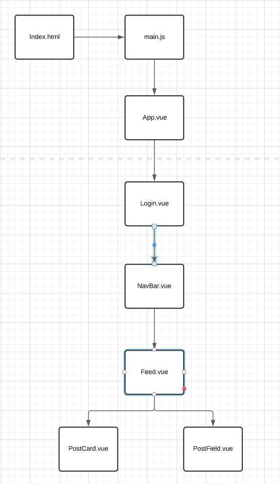
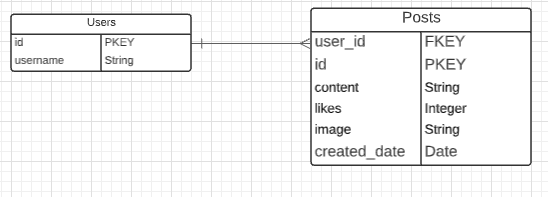

<h1 align="center">Finstagram</h1>

 

### Date: October 7th, 2021

### **Authors**: Itallo Gama ([GitHub](https://github.com/ItalloGama) | [LinkedIn](https://www.linkedin.com/in/itallo-gama/)), Robert Thome ([Github](https://github.com/robertthome) | [LinkedIn](https://www.linkedin.com/in/robert-c-thome/)), Wei Jun Xia ([GitHub](https://github.com/weijunxia) | [LinkedIn](https://www.linkedin.com/in/w3i/))

___

## About
Finstagram is a full-stack application built with a Vue frontend and Flask backend. Finstagram is a no frills social media platform where users post pictures and receive likes.

[Live Demo]()
 

## 📊 Component Hierarchy Diagram

 

## 📊 Entity Relationship Diagram

A Trello board was used to keep track of development progress and can be viewed [here](https://trello.com/invite/b/P1H7Duor/5a7751b08cdb3b76a0fae50c7227af9b/hackathon)

## 🗓 Future Updates
- [ ] Add Authentication 
- [ ] Add Commenting